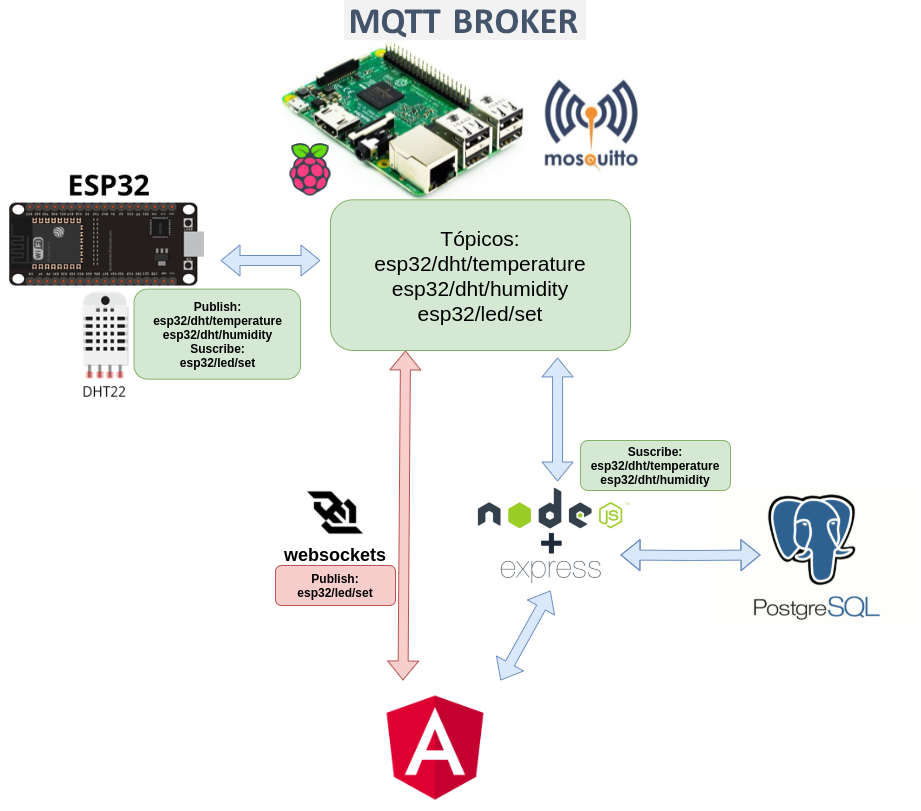
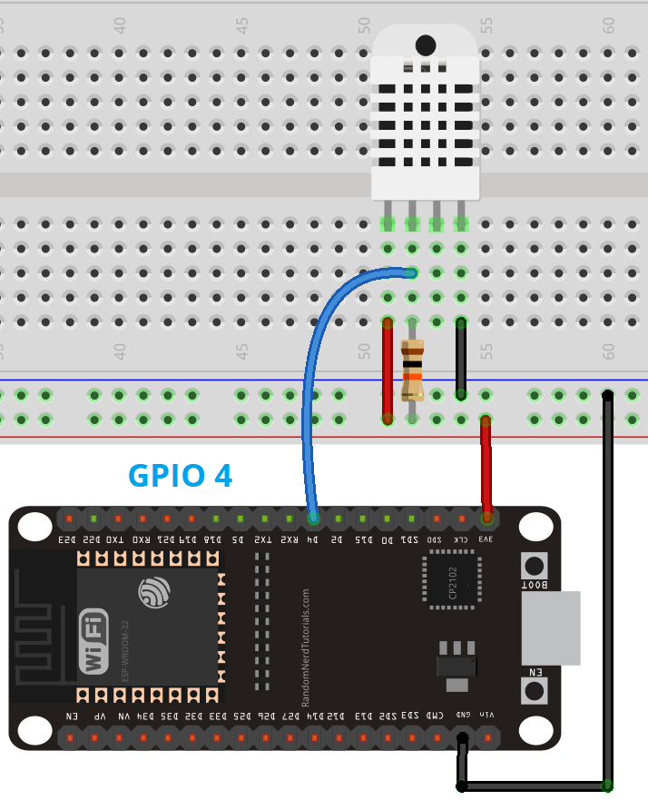

# Proyecto final de Desarrollo de aplicaciones IoT

Authors:
* Pedro Rosito
* Christian Canaan

Curso: 3CEIoT

## Proyecto: Medición de temperatura y humedad con ESP32

## Contenido:

* [Introducción](#Introducción)
* [Descripción](#Descripción)
* [Herramientas](#Herramientas)
* [Requerimientos](#Requerimientos)
* [Instalación](#Instalación)
* [Configuración](#Configuración)
* [Ejecución](#Ejecución)
* [Funcionalidad](#Funcionalidad)
* [Finalización](#Finalización)

## Introducción

El siguiente proyecto se realizo en el marco de entrega como trabajo final de la materia de desarrollo de aplicaciones IoT dictada en la 3er cohorte de IoT (3CEIoT) de la UBA.

## Descripción



La aplicación capaz de mostrar datos de humedad y temperatura registrados por un sensor DHT22 conectado a un ESP32 comunicado con una base de datos en PostgreSQL a través del protocolo MQTT. La aplicación muestra los valores de humedad y temperatura almacenados en la base de datos en un grafico de lineas en una pagina web. Como funcionalidad adicional se agregaron dos botones que permiten controlar el led onboard del ESP32 a través de websockets directamente desde el Frontend del proyecto.

El sensor toma un dato de temperatura y humedad cada 10 segundos, estos datos son publicados por el ESP32 a través del protocolo MQTT y son almacenados en una base datos PostgreSQL. El Backend desarrollado en Node y Express se suscribe a los tópicos MQTT y consulta los datos a la base de datos para mostrarlos en la pagina web desarrollada en Angular.

La funcionalidad de encendido y apagado del led Onboard del ESP32 utiliza websockets para enviar el comando "on/off". Se genero un tópico nuevo para enviar los comandos y recibir el estado actual del led

## Herramientas

* [Materializecss](https://materializecss.com/)
* [Visual Studio Code](https://code.visualstudio.com/) como entorno de desarrollo
* [pgAdmin4](https://www.pgadmin.org/docs/)
* [arduinoIDE](https://www.arduino.cc/en/software)
* [PostgreSQL](https://www.postgresql.org/docs/)
* [Angular](https://angular.io/docs)
* [NodeJS](https://nodejs.org/es/docs/)
* [ExpressJS](https://expressjs.com/es/)
* [github](https://github.com/)
* [gitflow](https://www.atlassian.com/es/git/tutorials/comparing-workflows/gitflow-workflow)
* [mosquitto](https://mosquitto.org/)
* [RaspberryPI4](https://www.raspberrypi.org/documentation/)
* [ESP32](https://www.espressif.com/en/products/modules/esp32)
* [DHT22](https://www.hwlibre.com/dht22/)


## Requerimientos

Para poder ejecutar el proyecto es necesario:
* Un ESP32
* Un DHT22
* Cables de conexión
* Resistencia de 1k Ohms 5%
* Dispositivo con el broker mosquitto instalado, configurado y conectado a la misma red local.
* Instalaciones y configuraciones detalladas en los apartados siguientes. 

Puertos necesarios: 
* 1883 mosquitto sobre TCP
* 9001 mosquitto sobre websockets
* 4200 Pagina web
* 3000 Backend

## Instalación

* [Arduino IDE Windows](https://randomnerdtutorials.com/installing-the-esp32-board-in-arduino-ide-windows-instructions/)
* [Arduino IDE Ubuntu](https://ubunlog.com/arduino-ide-en-ubuntu/)
* [mosquitto](https://randomnerdtutorials.com/how-to-install-mosquitto-broker-on-raspberry-pi/) Para este proyecto el broker mosquitto se corrio sobre una Raspberry Pi 4
* [PostgreSQL Windows](https://www.postgresql.org/download/windows/)
* [PostgreSQL Ubuntu](https://www.postgresql.org/download/linux/ubuntu/)
* [pgAdmin Windows](https://www.pgadmin.org/download/pgadmin-4-windows/)
* [pgAdmin Ubuntu](https://www.pgadmin.org/download/pgadmin-4-apt/)
* [NodeJS Ubuntu](https://www.geeksforgeeks.org/installation-of-node-js-on-linux/)
* [Angular CLI](https://desarrolloweb.com/articulos/angular-cli.html#:~:text=Angular%20CLI%20es%20una%20herramienta,se%20instala%20v%C3%ADa%20%22npm%22.)
* [ExpressJS Ubuntu](https://expressjs.com/es/starter/installing.html)

## Configuración

* [Arduino IDE](https://randomnerdtutorials.com/installing-the-esp32-board-in-arduino-ide-windows-instructions/)
* [Firmware](https://randomnerdtutorials.com/esp32-mqtt-publish-dht11-dht22-arduino/) Para el cargado del firmware en el ESP32
* [mosquitto](https://medium.com/@anant.lalchandani/dead-simple-mqtt-example-over-websockets-in-angular-b9fd5ff17b8e) para generar el listening de websockets.
* Creación de base de datos PostgreSQL en pgAdmin4: Hay que correr los comandos SQL en el archivo existente en dumpSQL para crear el esquema de la bases de datos. La base debe estar online durante la ejecución del proyecto.

## Ejecución

Habiendo completada la descarga y configuración de las herramientas, el primer paso es realizar todas las conexiones del sensor DHT22 con el ESP32 como se indica en la siguiente imagen:



Luego conectar la Rasberry y asegurarse de tener el servicio de mosquitto corriendo ejecutando el siguiente comando:
```
mosquitto -c /etc/mosquitto/conf.d/default.conf
```

Finalmente se debe descargar el contenido de este repositorio, para ello puede posicionarse por linea de comando dentro del directorio donde desea guardar el proyecto y ejecutar la siguiente linea de comando:

```
git clone https://github.com/PedroRosito/TPFinal_DDA3
```
Descargado el proyecto, abrimos el Visual Studio Code y abrimos dos terminales en las siguientes ubicaciones:
```
/TPFinal_DDA3/Frontend
/TPFinal_DDA3/Backend
```
en cada terminal es necesario ejecutar el comando:
```
npm install
```
Una vez terminada las instalaciones, en el terminal del Backend ejecutar el comando:
```
node app.js
```
Y en el terminal del Frontend ejecutar:
```
ng serve
```

Si todo se ejecuta correctamente en el navegador abrir http://localhost:4200/ y debería verse el index de la pagina, que por defecto muestra la tabla con los valores de temperatura medidos y almacenados en la base de datos. 


## Funcionalidad

La pagina muestra por defecto el grafico de los valores de temperatura almacenados en la base de datos, pero con las pestañas "Temperatura" y "Humedad" se puede seleccionar que grafica visualizar. Ademas, se puede controlar el estado del led Onboard del ESP32 con los botones "On/Off" disponibles en la pagina.


## Finalización
Para terminar la ejecución, ir a los terminales y simplemente teclear Ctrl+C en ambos; cerrar la base de datos y desconectar todos los componentes. 
